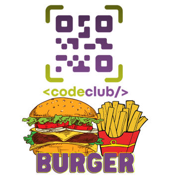
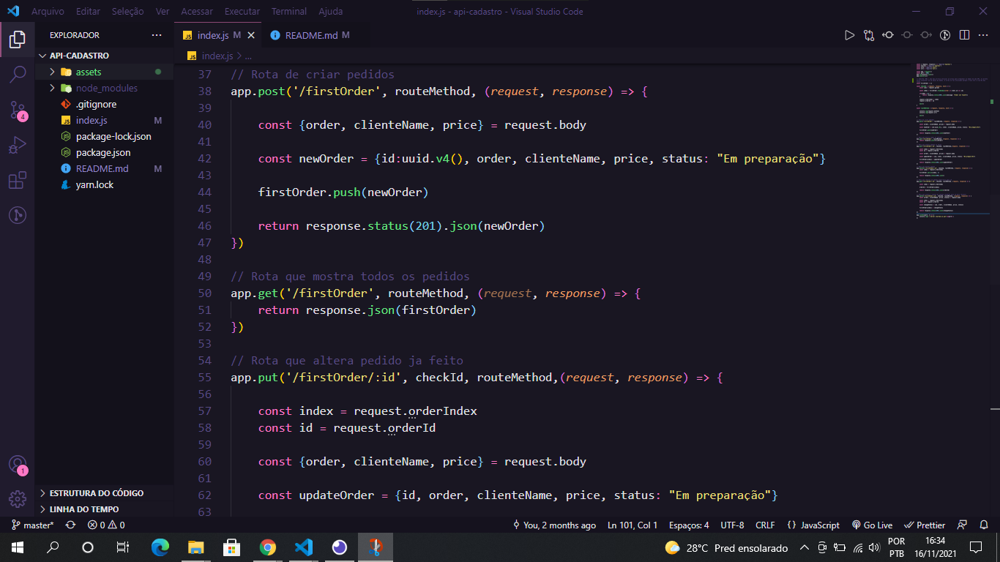

<h1 align="center">
    
    <p>API-Burger</p>
</h1>

> ## 💻 Projeto
Burger é uma aplicação simples onde o usuário pode adicionar e excluir pedidos de uma hamburgueria. Essa API armazena o id, nome do pedido, nome do cliente, o preço e o status do pedido.

> ## 📸 Demo



> ## 🚀 Tecnologias
Esse projeto foi desenvolvido com as seguintes tecnologias:
* [JavaScript](https://developer.mozilla.org/pt-BR/docs/Web/JavaScript)
* [Node.js](https://nodejs.org/en/)
* [Express](https://expressjs.com/pt-br/)
* [Nodemon](https://www.npmjs.com/package/nodemon)
* [uuid](https://www.npmjs.com/package/uuid)
* [cors](https://www.npmjs.com/package/cors)

>## Pré-requisitos

Antes de começar, você vai precisar ter instalado em sua máquina as seguintes ferramentas:
[Git](https://git-scm.com), [Node.js](https://nodejs.org/en/). 
Além disto é bom ter um editor para trabalhar com o código como [VSCode](https://code.visualstudio.com/)

### 🎲 Rodando o Back End (servidor)

```bash
# Clone este repositório
$ git clone <https://github.com/W-Carlos/API-Burger.git>

# Acesse a pasta do projeto no terminal/cmd
$ cd API-Burger

# Instale as dependências
$ yarn
# ou
$ npm install

# Execute a aplicação em modo de desenvolvimento
$ yarn dev

# O servidor inciará na porta:3001 - acesse <http://localhost:3001>
```

>## 📄 Licença
Este projeto está sob a licença MIT. Veja o arquivo <a href="https://github.com/W-Carlos/API-Burger/blob/master/LICENSE">LICENSE</a> para mais detalhes.

---
<p align="center">Feito por Wend Carlos 👋</p>